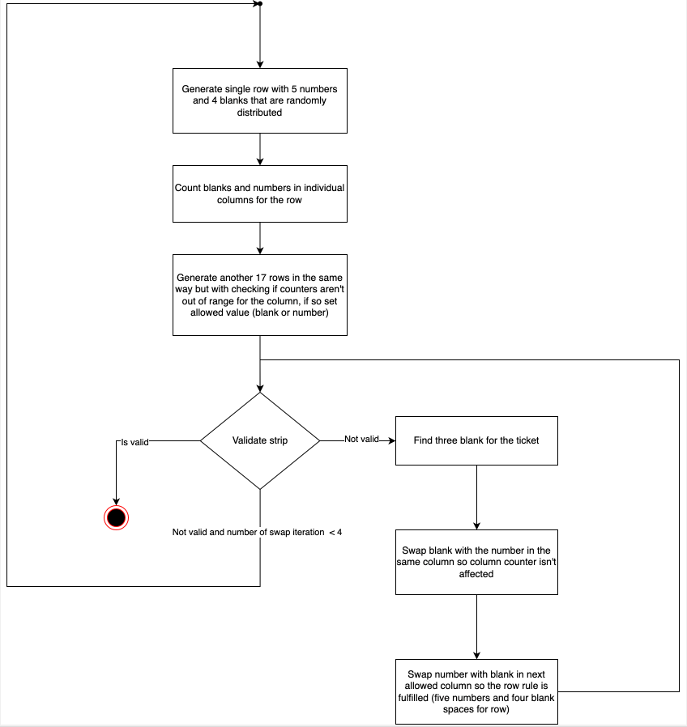

# Bingo Ticket Generator

## Requirements

### Functional Requirements Checklist

- [x] Generate a strip of 6 tickets
- [x] A bingo ticket consists of 9 columns and 3 rows.
- [x] Each ticket row contains five numbers and four blank spaces
- [x] Each ticket column consists of one, two or three numbers and never three blanks.
  - [x] The first column contains numbers from 1 to 9 (only nine),
  - [x] The second column numbers from 10 to 19 (ten), the third, 20 to 29 and so on up until
  - [x] The last column, which contains numbers from 80 to 90 (eleven).
- [x] Numbers in the ticket columns are ordered from top to bottom (ASC).
- [x] There can be **no duplicate** numbers between 1 and 90 **in the strip** (since you generate 6 tickets with 15 numbers each)

### Non-Functional Requirements Checklist
- [x] Generate 10k strip in less than 1 second.

## Sample output
```
------------------------------------------
STRIP
------------------------------------------
 1   --   22   33   42   56   --   --   --
--   13   --   38   44   --   60   75   --
 8   18   23   --   --   --   67   --   80

------------------------------------------
 6   --   27   --   40   53   --   --   81
--   --   --   31   --   54   66   73   82
--   14   --   39   --   59   68   --   86

------------------------------------------
--   10   24   30   49   --   --   77   --
--   --   28   32   --   51   64   --   84
 4   11   --   35   --   52   --   --   88

------------------------------------------
--   15   21   37   48   --   --   76   --
 3   17   --   --   --   50   --   78   83
 5   --   29   --   --   55   61   79   --

------------------------------------------
--   --   26   34   --   58   --   70   85
--   12   --   --   45   --   62   72   87
 7   19   --   --   46   --   --   74   89

------------------------------------------
--   --   20   --   41   57   63   --   90
 2   --   25   --   43   --   65   71   --
 9   16   --   36   47   --   69   --   --
```

## Quick Start
The application is based on Java 17 and uses Gradle build system.

To build Bingo Ticket Generator from source, use the following command in the main directory:

    ./gradlew clean build

You can run it like this:

    ./gradlew run

To run performance tests:

    ./gradlew jmh

## Algorithm Description - Count & Swap
To reduce complexity of the single component Bingo strip generator was split into two main parts:
- Strip Position Generator
- Strip Number Generator

### Strip Position Generator
The Strip Position Generator is the most challenging and contains logic that will decide where to insert numbers or blank spaces. The non-functional requirement to generate 10,000 strips per second excludes brute-force (BFS) algorithms, as they were found to be inadequate for meeting this requirement.

The algorithm used in this implementation is fairly easy and is based on counting and swapping randomly generated positions for each column individually. If the maximum allowed number of blanks or numbers have been reached(please note that positions are generated randomly), then default value is inserted.

After the initial generation, we still have a problem with three blanks in a column on the ticket. To eliminate this, we can swap cells in the column and in the row so that the counters are not affected. If the validation is failing for a few iterations (4), then the algorithm will start over. See the diagram below:


The positions (number and blank spaces) are randomly distributed across the whole strip, and this can be verified by running the code multiple times and observing the randomized distribution of positions.

### Strip Number Generator
The strip number generator is responsible for generating random numbers in specific range that is set for each column. 

## Performance tests results
Java Microbenchmark Harness (JMH) was used to test the application's performance in generating Bingo strips. The test results indicate that the application can generate around 37,000 bingo strips in one second on the MacBook Pro with i7 CPU.

```
# Warmup Iteration   1: 35405.849 ops/s
# Warmup Iteration   2: 38540.496 ops/s
# Warmup Iteration   3: 37974.565 ops/s
# Warmup Iteration   4: 38862.848 ops/s
# Warmup Iteration   5: 36157.415 ops/s
Iteration   1: 36241.553 ops/s[8m]
Iteration   2: 39712.463 ops/s[8m 10s]
Iteration   3: 36332.169 ops/s[8m 20s]
Iteration   4: 37749.781 ops/s[8m 30s]
Iteration   5: 38465.003 ops/s[8m 40s]

Benchmark                          Mode  Cnt      Score      Error  Units
StripGeneratorBenchmark.generate  thrpt   25  37858.466 ± 2482.289  ops/s
```